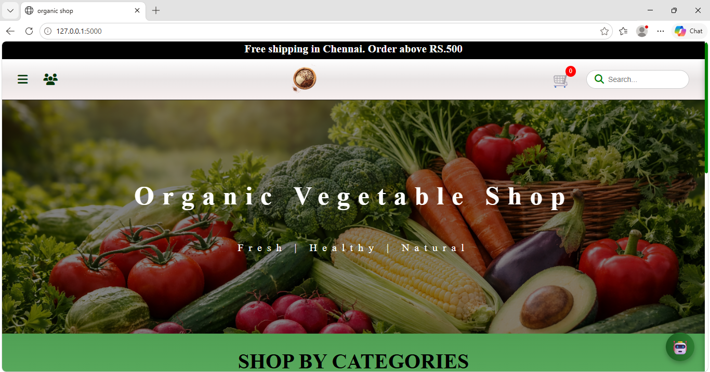
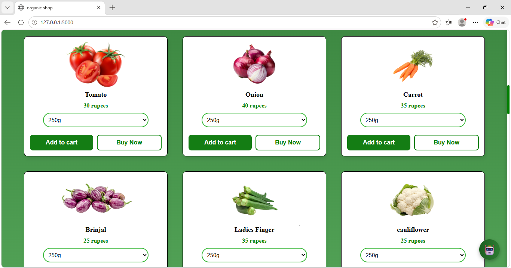
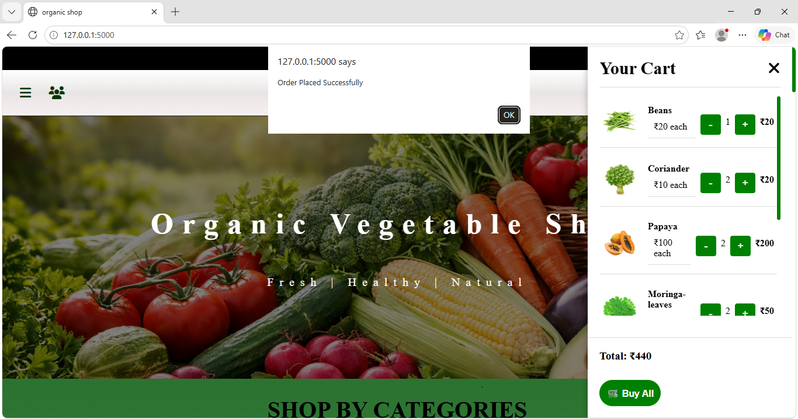
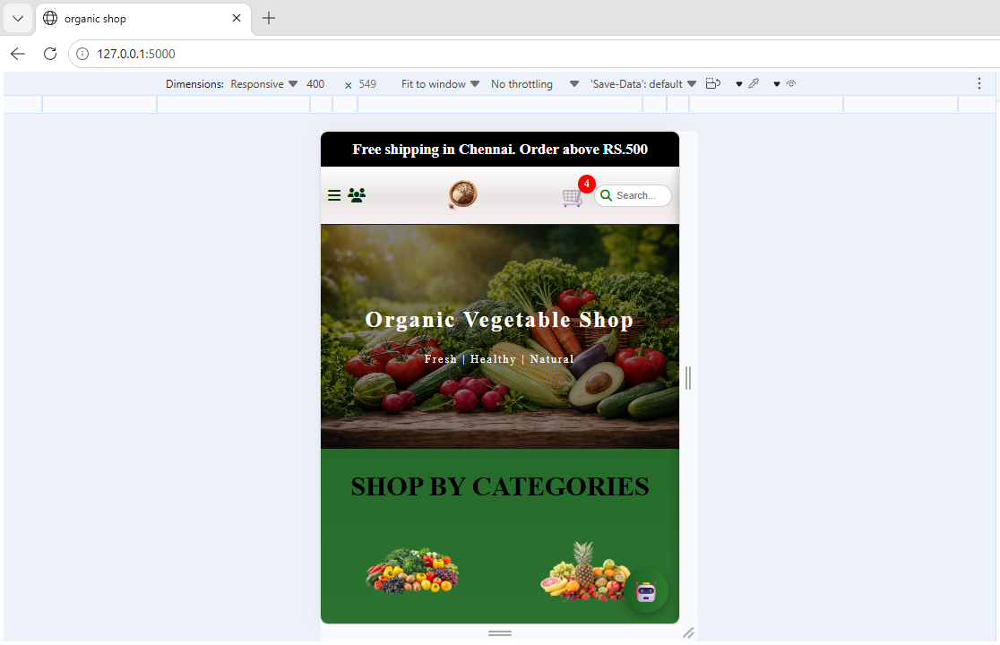

# 🥬 HarvestHub — Organic Platform & Smart Assistant

> **Making healthy food shopping more accessible, and user-friendly through technology.**

• HarvestHub is a responsive organic shopping platform designed to make online shopping for fresh and healthy food simple and convenient.

• Users can explore different food categories, search for products, manage their shopping cart, and receive simple health-based product recommendations through an easy-to-    use interface.

---

## 🌱 The Idea Behind HarvestHub

• The idea was to create a simple online space where people can easily explore fresh food products.

• Along with regular shopping features, HarvestHub includes basic health-based recommendations to make product discovery more useful and personalized.

> **Healthy choices, made simpler through technology.**

---

## 🧰 Built With

• **Python & Flask** - Used to handle the backend and web application logic.

• **HTML** - Used to structure the web pages and content.

• **CSS** - Used for styling and creating a responsive layout.

• **JavaScript** - Used for interactive features such as search, cart management, and recommendations.

• **SQLite** - Used for lightweight data storage.

---

## 📸 Project Showcase

### Homepage



### Products



### Shopping Cart



### AI Bot


### Mobile View



---
## 🌐 Live Demo

👉 [View HarvestHub Live](https://harvesthub-puma.onrender.com)


## 📂 Project Structure

```text
HarvestHub/
│
├── app.py
├── requirements.txt
│
├── templates/
│   └── index.html
│
├── static/
│   ├── css/
│   │   └── style.css
│   │
│   ├── js/
│   │   └── script.js
│   │
│   └── images/
│
└── screenshots/
    ├── homepage.png
    ├── products.png
    ├── cart.png
    └── mobile-view.png
```
---
## 🔄 Workflow

* **Browse:** Explore products by category.
* **Search:** Find products quickly.
* **Cart:** Add products and update quantities.
* **Recommendations:** Get health-based product suggestions.
* **Checkout:** Review selected products and complete the order.

## 📚 What I Learned

Learned to build **Flask routes, form handling, and backend logic** for a web application. Improved my understanding of **responsive UI design and integrating frontend interactions with Flask**.

### 👩‍💻 Developed By

**Poornima**

